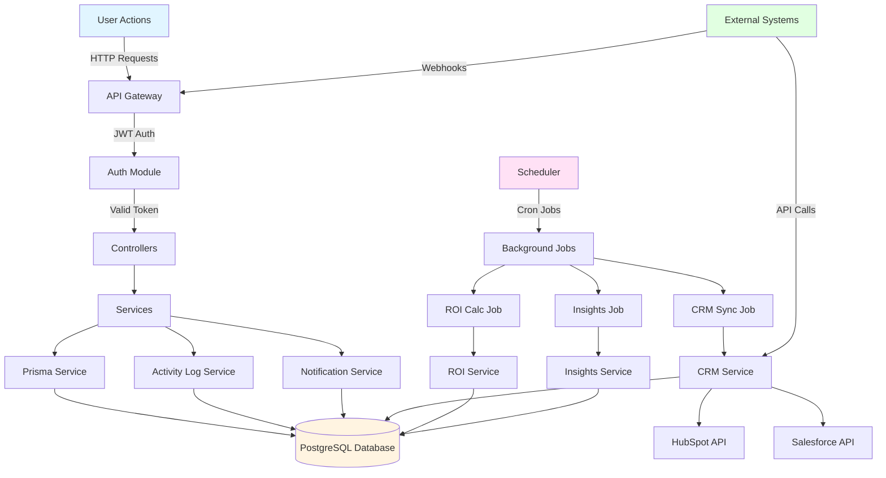

# Data Flow Diagram



## Data Flow by Module

### Event Creation Flow
```
User → API → EventsController → EventsService → Prisma → Database
                                      ↓
                              ActivityLogService → Database
                                      ↓
                              NotificationService → Database (notify stakeholders)
```

### Expense Approval Flow
```
User → API → ExpensesController → ExpensesService → Prisma → Database
                                      ↓
                              ApprovalService → Determine Approvers
                                      ↓
                              NotificationService → Notify Approvers → Database
                                      ↓
                              ActivityLogService → Log Approval → Database
```

### Budget Versioning Flow
```
User → API → BudgetsController → BudgetsService → Prisma → Database
                                      ↓
                              ActivityLogService → Log Creation → Database
                                      ↓
                              (On Finalize) Unmark other versions → Database
```

### CRM Sync Flow
```
Scheduler → CrmSyncJob → CrmService → Build Payload
                                      ↓
                              HubSpot/Salesforce Provider → External API
                                      ↓
                              CrmService → Store Result → Database
                                      ↓
                              ActivityLogService → Log Sync → Database
```

### ROI Calculation Flow
```
Scheduler → RoiCalcJob → RoiService → Fetch Expenses + CRM Data
                                      ↓
                              Calculate Metrics
                                      ↓
                              Upsert ROIMetrics → Database
```

### Report Generation Flow
```
User → API → ReportsController → ReportsService → Fetch Event Data
                                      ↓
                              Report Generator → Generate Report Data
                                      ↓
                              Create Report Record → Database
                                      ↓
                              Create File Record → Database
                                      ↓
                              (In Production) Upload to S3 → Return URL
```

## Multi-Tenancy Flow

All data access flows through organization scoping:

```
Request → JWT Token → Extract organizationId
                              ↓
                    Filter all queries by organizationId
                              ↓
                    Ensure user.organizationId matches resource.organizationId
                              ↓
                    Return scoped results
```

## Background Processing Flow

```
Scheduler (NestJS Schedule)
    ├── Every 5 minutes → CRM Sync Job
    │   └── Find events needing sync
    │       └── Sync to CRM
    │           └── Update CRMSync table
    │
    ├── Every hour → ROI Calc Job
    │   └── Find events with new data
    │       └── Calculate ROI
    │           └── Update ROIMetrics table
    │
    └── Daily at 2 AM → Insights Job
        └── Find events with activity
            └── Generate insights
                └── Create Insight records
```

