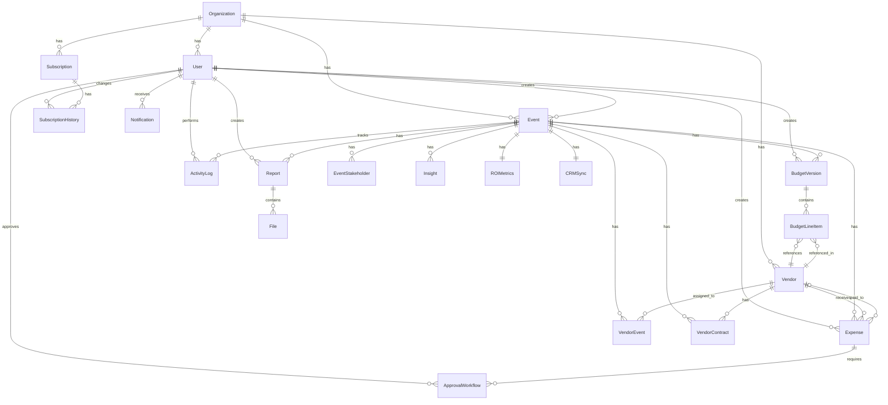

# ER Diagram - Event Budget Planning System

## Entity Relationships

### Organization (Root Entity)
- Has many Users
- Has many Subscriptions
- Has many Vendors
- Has many Events

### User
- Belongs to Organization (optional)
- Creates Events
- Creates BudgetVersions
- Creates Expenses
- Approves Expenses (via ApprovalWorkflow)
- Changes Subscriptions (via SubscriptionHistory)
- Performs Actions (via ActivityLog)
- Receives Notifications
- Creates Reports

### Event (Core Entity)
- Belongs to Organization
- Created by User
- Has Stakeholders
- Has Budget Versions
- Has Expenses
- Has Vendor Assignments
- Has Vendor Contracts
- Has Insights
- Has ROI Metrics (1:1)
- Has CRM Sync (1:1)
- Has Reports
- Tracks Activity Logs

### BudgetVersion
- Belongs to Event
- Created by User
- Contains BudgetLineItems
- Only one can be marked as final per event

### BudgetLineItem
- Belongs to BudgetVersion
- References Vendor (optional)
- Has estimated and actual costs

### Expense
- Belongs to Event
- Created by User
- References Vendor (optional)
- Requires ApprovalWorkflow

### ApprovalWorkflow
- Belongs to Expense
- Approved by User
- Tracks approval/rejection actions

### Vendor
- Belongs to Organization
- Assigned to Events (via VendorEvent)
- Has Contracts (via VendorContract)
- Referenced in BudgetLineItems
- Receives Expenses

### ROIMetrics
- One-to-one with Event
- Calculated from Expenses and CRM data

### CRMSync
- One-to-one with Event
- Stores sync status and data

### Report
- Belongs to Event
- Created by User
- Contains Files

