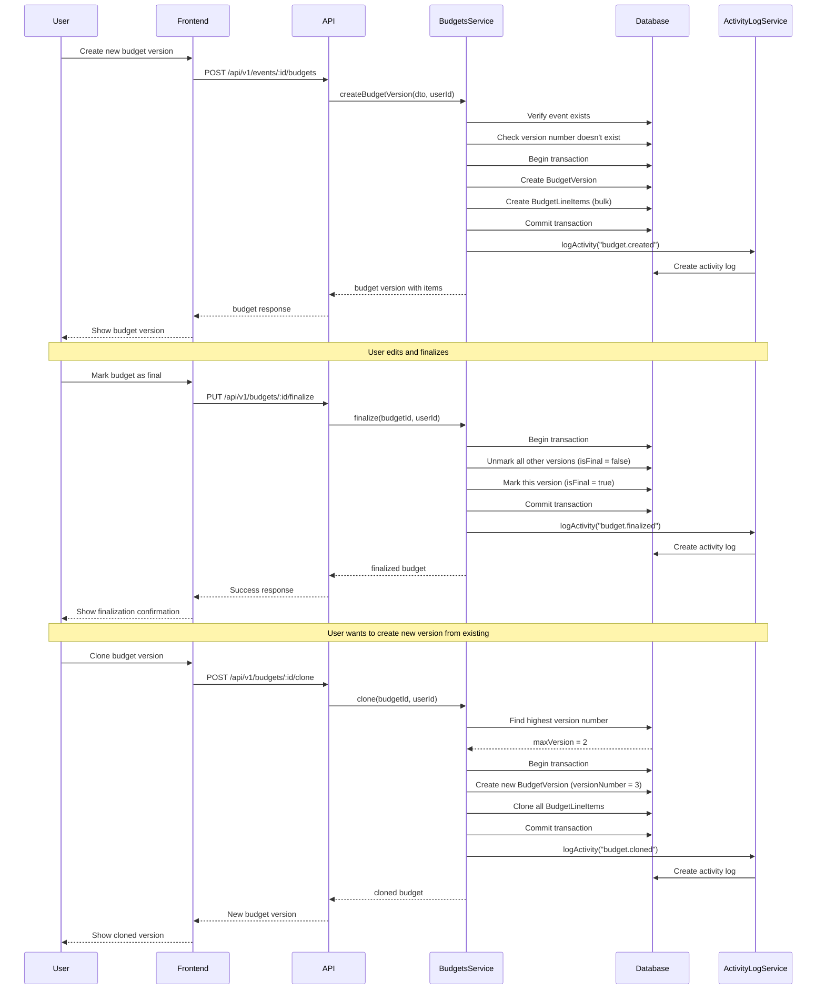

# Budget Versioning Flow Sequence Diagram

```mermaid
sequenceDiagram
    participant U as User
    participant FE as Frontend
    participant API as API
    participant BS as BudgetsService
    participant DB as Database
    participant AL as ActivityLogService

    U->>FE: Create new budget version
    FE->>API: POST /api/v1/events/:id/budgets
    API->>BS: createBudgetVersion(dto, userId)
    BS->>DB: Verify event exists
    BS->>DB: Check version number doesn't exist
    BS->>DB: Begin transaction
    BS->>DB: Create BudgetVersion
    BS->>DB: Create BudgetLineItems (bulk)
    BS->>DB: Commit transaction
    BS->>AL: logActivity("budget.created")
    AL->>DB: Create activity log
    BS-->>API: budget version with items
    API-->>FE: budget response
    FE-->>U: Show budget version

    Note over U,AL: User edits and finalizes

    U->>FE: Mark budget as final
    FE->>API: PUT /api/v1/budgets/:id/finalize
    API->>BS: finalize(budgetId, userId)
    BS->>DB: Begin transaction
    BS->>DB: Unmark all other versions (isFinal = false)
    BS->>DB: Mark this version (isFinal = true)
    BS->>DB: Commit transaction
    BS->>AL: logActivity("budget.finalized")
    AL->>DB: Create activity log
    BS-->>API: finalized budget
    API-->>FE: Success response
    FE-->>U: Show finalization confirmation

    Note over U,AL: User wants to create new version from existing

    U->>FE: Clone budget version
    FE->>API: POST /api/v1/budgets/:id/clone
    API->>BS: clone(budgetId, userId)
    BS->>DB: Find highest version number
    DB-->>BS: maxVersion = 2
    BS->>DB: Begin transaction
    BS->>DB: Create new BudgetVersion (versionNumber = 3)
    BS->>DB: Clone all BudgetLineItems
    BS->>DB: Commit transaction
    BS->>AL: logActivity("budget.cloned")
    AL->>DB: Create activity log
    BS-->>API: cloned budget
    API-->>FE: New budget version
    FE-->>U: Show cloned version
```

