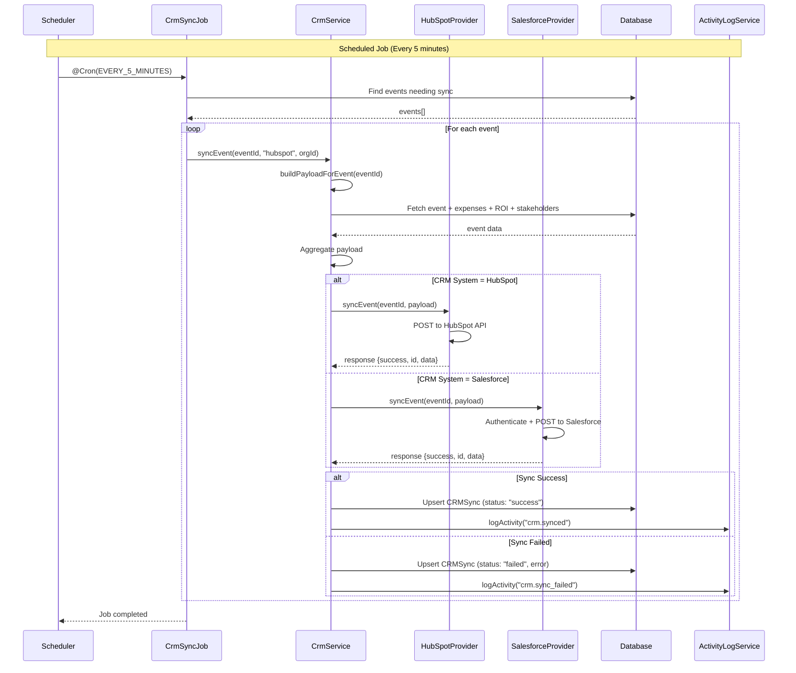
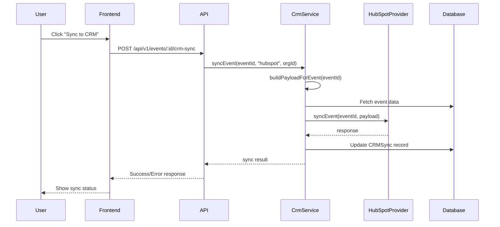

# CRM Sync Flow Sequence Diagram

```mermaid
sequenceDiagram
    participant Cron as Scheduler
    participant Job as CrmSyncJob
    participant CS as CrmService
    participant HP as HubSpotProvider
    participant SF as SalesforceProvider
    participant DB as Database
    participant AL as ActivityLogService

    Note over Cron,AL: Scheduled Job (Every 5 minutes)

    Cron->>Job: @Cron(EVERY_5_MINUTES)
    Job->>DB: Find events needing sync
    DB-->>Job: events[]
    
    loop For each event
        Job->>CS: syncEvent(eventId, "hubspot", orgId)
        CS->>CS: buildPayloadForEvent(eventId)
        CS->>DB: Fetch event + expenses + ROI + stakeholders
        DB-->>CS: event data
        CS->>CS: Aggregate payload
        
        alt CRM System = HubSpot
            CS->>HP: syncEvent(eventId, payload)
            HP->>HP: POST to HubSpot API
            HP-->>CS: response {success, id, data}
        else CRM System = Salesforce
            CS->>SF: syncEvent(eventId, payload)
            SF->>SF: Authenticate + POST to Salesforce
            SF-->>CS: response {success, id, data}
        end
        
        alt Sync Success
            CS->>DB: Upsert CRMSync (status: "success")
            CS->>AL: logActivity("crm.synced")
        else Sync Failed
            CS->>DB: Upsert CRMSync (status: "failed", error)
            CS->>AL: logActivity("crm.sync_failed")
        end
    end
    
    Job-->>Cron: Job completed
```

## Manual Sync Flow

```mermaid
sequenceDiagram
    participant U as User
    participant FE as Frontend
    participant API as API
    participant CS as CrmService
    participant HP as HubSpotProvider
    participant DB as Database

    U->>FE: Click "Sync to CRM"
    FE->>API: POST /api/v1/events/:id/crm-sync
    API->>CS: syncEvent(eventId, "hubspot", orgId)
    CS->>CS: buildPayloadForEvent(eventId)
    CS->>DB: Fetch event data
    CS->>HP: syncEvent(eventId, payload)
    HP-->>CS: response
    CS->>DB: Update CRMSync record
    CS-->>API: sync result
    API-->>FE: Success/Error response
    FE-->>U: Show sync status
```

