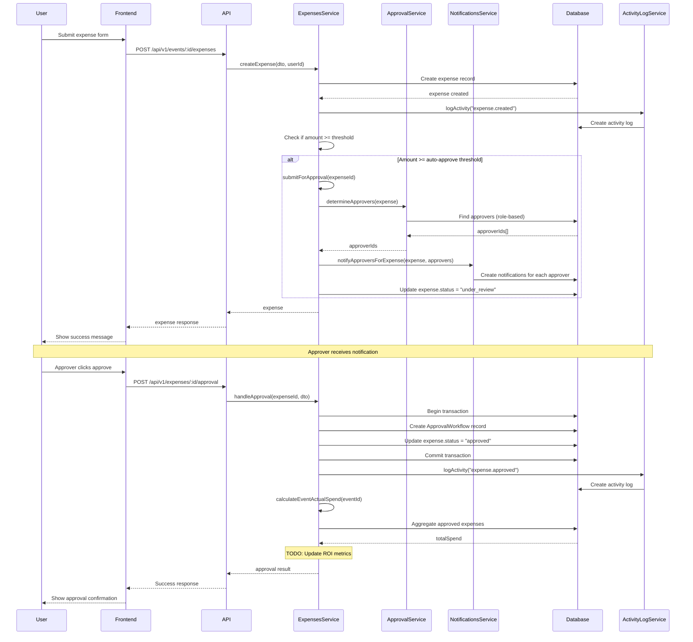

# Expense Approval Flow Sequence Diagram

```mermaid
sequenceDiagram
    participant U as User
    participant FE as Frontend
    participant API as API
    participant ES as ExpensesService
    participant AS as ApprovalService
    participant NS as NotificationsService
    participant DB as Database
    participant AL as ActivityLogService

    U->>FE: Submit expense form
    FE->>API: POST /api/v1/events/:id/expenses
    API->>ES: createExpense(dto, userId)
    ES->>DB: Create expense record
    DB-->>ES: expense created
    ES->>AL: logActivity("expense.created")
    AL->>DB: Create activity log
    ES->>ES: Check if amount >= threshold
    alt Amount >= auto-approve threshold
        ES->>ES: submitForApproval(expenseId)
        ES->>AS: determineApprovers(expense)
        AS->>DB: Find approvers (role-based)
        DB-->>AS: approverIds[]
        AS-->>ES: approverIds
        ES->>NS: notifyApproversForExpense(expense, approvers)
        NS->>DB: Create notifications for each approver
        ES->>DB: Update expense.status = "under_review"
    end
    ES-->>API: expense
    API-->>FE: expense response
    FE-->>U: Show success message

    Note over U,AL: Approver receives notification

    U->>FE: Approver clicks approve
    FE->>API: POST /api/v1/expenses/:id/approval
    API->>ES: handleApproval(expenseId, dto)
    ES->>DB: Begin transaction
    ES->>DB: Create ApprovalWorkflow record
    ES->>DB: Update expense.status = "approved"
    ES->>DB: Commit transaction
    ES->>AL: logActivity("expense.approved")
    AL->>DB: Create activity log
    ES->>ES: calculateEventActualSpend(eventId)
    ES->>DB: Aggregate approved expenses
    DB-->>ES: totalSpend
    Note over ES: TODO: Update ROI metrics
    ES-->>API: approval result
    API-->>FE: Success response
    FE-->>U: Show approval confirmation
```

