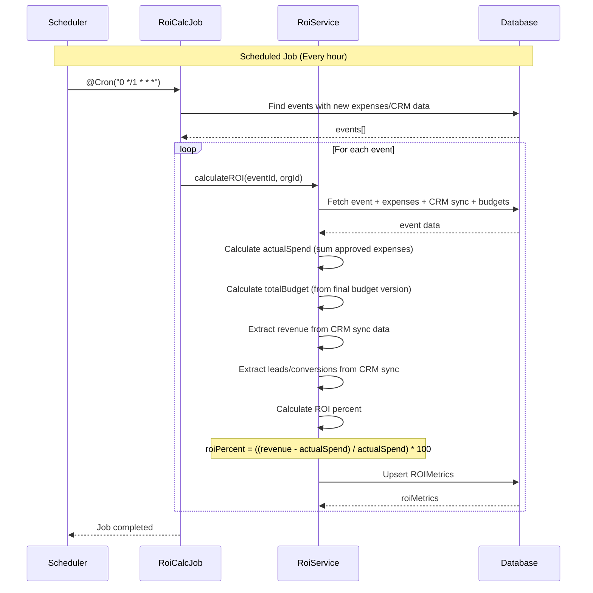
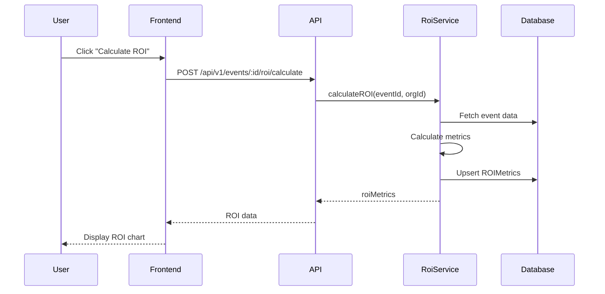

# ROI Calculation Flow Sequence Diagram

```mermaid
sequenceDiagram
    participant Cron as Scheduler
    participant Job as RoiCalcJob
    participant RS as RoiService
    participant DB as Database

    Note over Cron,DB: Scheduled Job (Every hour)

    Cron->>Job: @Cron("0 */1 * * *")
    Job->>DB: Find events with new expenses/CRM data
    DB-->>Job: events[]
    
    loop For each event
        Job->>RS: calculateROI(eventId, orgId)
        RS->>DB: Fetch event + expenses + CRM sync + budgets
        DB-->>RS: event data
        
        RS->>RS: Calculate actualSpend (sum approved expenses)
        RS->>RS: Calculate totalBudget (from final budget version)
        RS->>RS: Extract revenue from CRM sync data
        RS->>RS: Extract leads/conversions from CRM sync
        
        RS->>RS: Calculate ROI percent
        Note over RS: roiPercent = ((revenue - actualSpend) / actualSpend) * 100
        
        RS->>DB: Upsert ROIMetrics
        DB-->>RS: roiMetrics
    end
    
    Job-->>Cron: Job completed
```

## Manual ROI Calculation

```mermaid
sequenceDiagram
    participant U as User
    participant FE as Frontend
    participant API as API
    participant RS as RoiService
    participant DB as Database

    U->>FE: Click "Calculate ROI"
    FE->>API: POST /api/v1/events/:id/roi/calculate
    API->>RS: calculateROI(eventId, orgId)
    RS->>DB: Fetch event data
    RS->>RS: Calculate metrics
    RS->>DB: Upsert ROIMetrics
    RS-->>API: roiMetrics
    API-->>FE: ROI data
    FE-->>U: Display ROI chart
```

