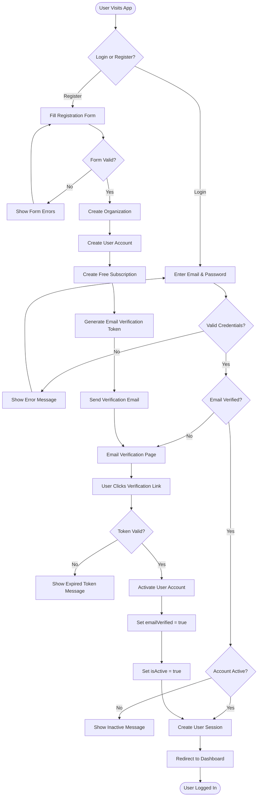
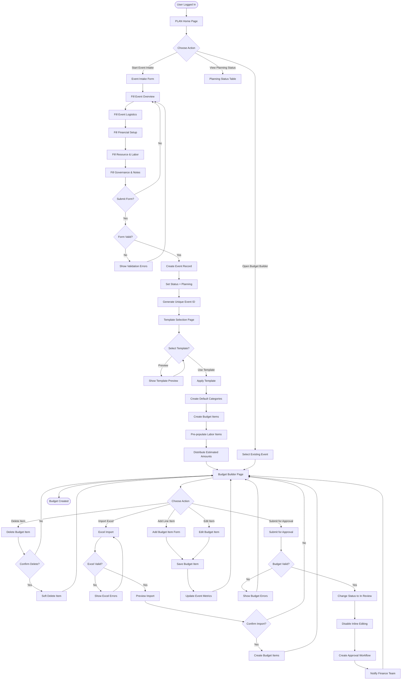
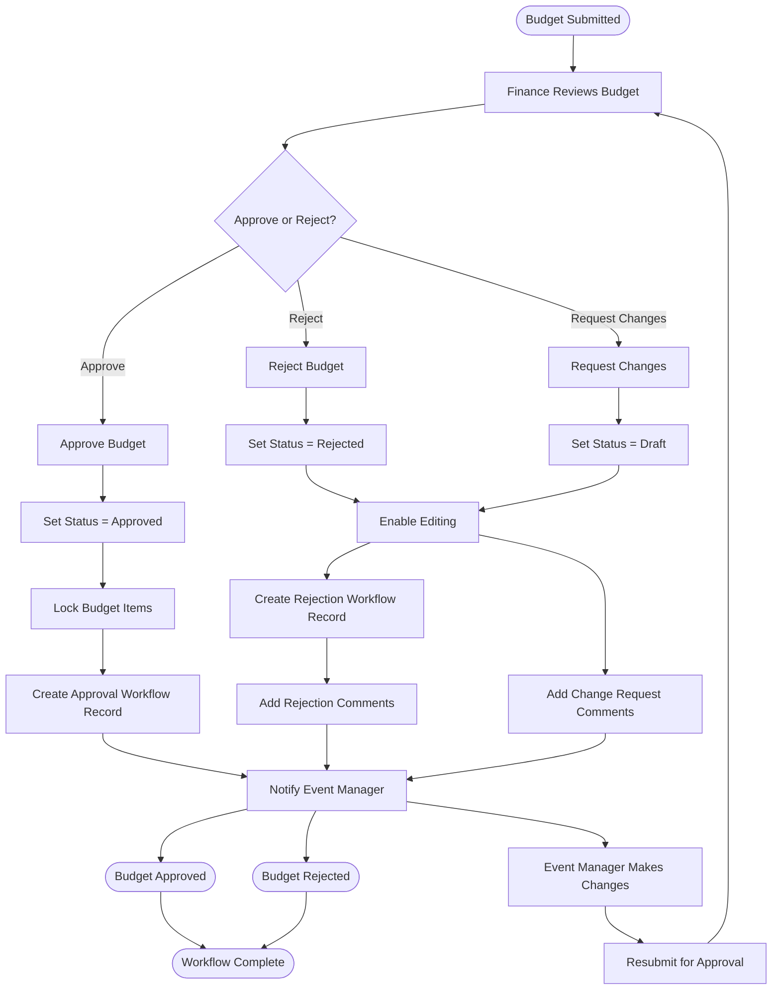
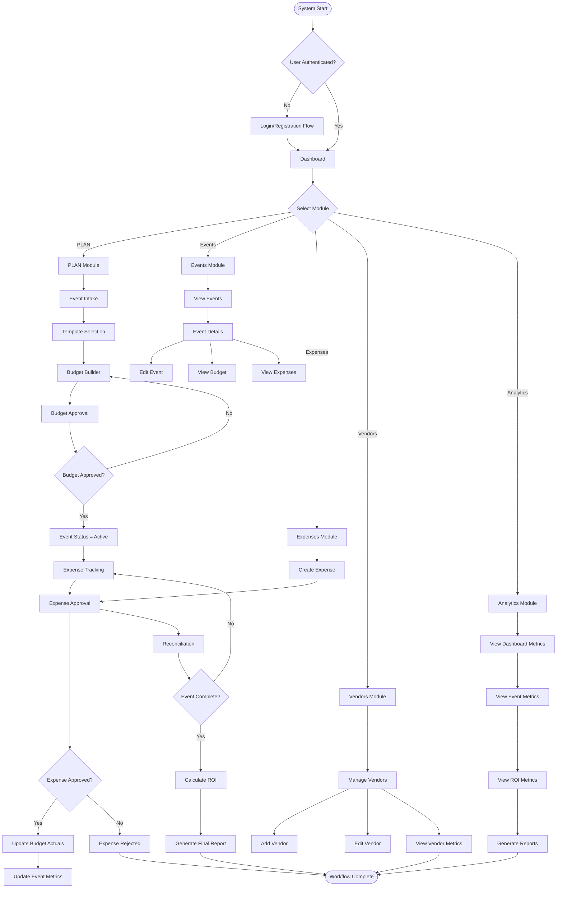
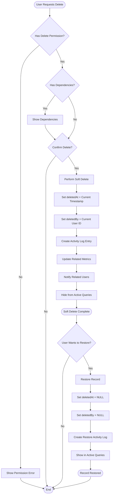

# Event Finance Manager - Client Presentation

**Complete System Documentation with ER Diagrams and Workflow Flowcharts**

---

## Table of Contents

1. [System Overview](#system-overview)
2. [Entity Relationship Diagram](#entity-relationship-diagram)
3. [User Registration & Authentication Flow](#user-registration--authentication-flow)
4. [Event Planning Workflow (PLAN Module)](#event-planning-workflow-plan-module)
5. [Budget Approval Workflow](#budget-approval-workflow)
6. [Expense Tracking & Approval Flow](#expense-tracking--approval-flow)
7. [Complete System Workflow](#complete-system-workflow)
8. [Soft Delete Process](#soft-delete-process)
9. [Database Schema Overview](#database-schema-overview)
10. [Key Features](#key-features)

---

## System Overview

**Event Finance Manager** is an enterprise-grade event budget management and financial governance platform designed to unify the event lifecycle—from intake, budgeting, approvals, vendor management, expense reconciliation, to ROI measurement—within a single system of record.

### Core Capabilities

- **Multi-Tenancy**: Support for multiple organizations with complete data isolation
- **Event Planning**: Structured event intake and budget creation
- **Budget Management**: Version-controlled budgets with approval workflows
- **Expense Tracking**: Real-time expense tracking with approval processes
- **Vendor Management**: Comprehensive vendor relationship management
- **Analytics & Reporting**: Pre-computed metrics and ROI calculations
- **Audit Compliance**: Complete audit trail with soft delete support

---

## Entity Relationship Diagram

The following diagram shows all database tables and their relationships:

```mermaid
erDiagram
    %% ============================================
    %% MULTI-TENANCY LAYER
    %% ============================================
    Organization ||--o{ User : "has"
    Organization ||--o{ Event : "has"
    Organization ||--o{ Vendor : "has"
    Organization ||--o{ Expense : "has"
    Organization ||--|| DashboardMetrics : "has one"
    Organization ||--o{ Subscription : "has"
    Organization ||--o{ Notification : "has"
    Organization ||--o{ ActivityLog : "has"
    
    %% ============================================
    %% USER RELATIONSHIPS
    %% ============================================
    User ||--o{ Event : "creates"
    User ||--o{ Expense : "creates"
    User ||--o{ EventAssignment : "assigned to"
    User ||--o{ BudgetItem : "assigned to"
    User ||--o{ ApprovalWorkflow : "approves"
    User ||--o{ Notification : "receives"
    User ||--o{ ActivityLog : "performs"
    User ||--o{ Report : "creates"
    User ||--o{ File : "uploads"
    User ||--o{ Note : "creates"
    User ||--o{ SubscriptionHistory : "changes"
    User ||--o{ Organization : "deletes"
    User ||--o{ User : "deletes"
    User ||--o{ Event : "deletes"
    User ||--o{ BudgetItem : "deletes"
    User ||--o{ Expense : "deletes"
    User ||--o{ Vendor : "deletes"
    User ||--o{ File : "deletes"
    User ||--o{ Note : "deletes"
    User ||--o{ Report : "deletes"
    User ||--o{ StrategicGoal : "deletes"
    User ||--o{ EventAssignment : "deletes"
    User ||--o{ EventStakeholder : "deletes"
    User ||--o{ VendorEvent : "deletes"
    User ||--o{ Insight : "deletes"
    User ||--o{ AiBudgetSuggestion : "deletes"
    User ||--o{ Subscription : "deletes"
    
    %% ============================================
    %% EVENT RELATIONSHIPS
    %% ============================================
    Event ||--o{ EventAssignment : "has"
    Event ||--o{ EventStakeholder : "has"
    Event ||--o{ BudgetItem : "has"
    Event ||--o{ Expense : "has"
    Event ||--o{ VendorEvent : "has"
    Event ||--o{ StrategicGoal : "has"
    Event ||--|| EventMetrics : "has one"
    Event ||--|| ROIMetrics : "has one"
    Event ||--|| CRMSync : "has one"
    Event ||--o{ File : "has"
    Event ||--o{ Note : "has"
    Event ||--o{ Insight : "has"
    Event ||--o{ Report : "has"
    Event ||--o{ AiBudgetSuggestion : "has"
    Event ||--o{ ActivityLog : "has"
    
    %% ============================================
    %% BUDGET RELATIONSHIPS
    %% ============================================
    BudgetItem }o--|| Event : "belongs to"
    BudgetItem }o--o| Vendor : "uses"
    BudgetItem }o--o| User : "assigned to"
    BudgetItem }o--o| StrategicGoal : "linked to"
    BudgetItem ||--o{ Expense : "tracks"
    BudgetItem ||--o{ ApprovalWorkflow : "has"
    BudgetItem ||--o{ File : "has"
    
    %% ============================================
    %% EXPENSE RELATIONSHIPS
    %% ============================================
    Expense }o--|| Event : "belongs to"
    Expense }o--o| BudgetItem : "linked to"
    Expense }o--o| Vendor : "uses"
    Expense }o--|| User : "created by"
    Expense ||--o{ ApprovalWorkflow : "has"
    Expense ||--o{ File : "has"
    
    %% ============================================
    %% VENDOR RELATIONSHIPS
    %% ============================================
    Vendor ||--o{ VendorEvent : "assigned to"
    Vendor ||--o{ BudgetItem : "used in"
    Vendor ||--o{ Expense : "used in"
    Vendor ||--|| VendorMetrics : "has one"
    
    %% ============================================
    %% APPROVAL WORKFLOW
    %% ============================================
    ApprovalWorkflow }o--o| Expense : "tracks"
    ApprovalWorkflow }o--o| BudgetItem : "tracks"
    ApprovalWorkflow }o--|| User : "by"
    
    %% ============================================
    %% SUBSCRIPTION
    %% ============================================
    Subscription ||--o{ SubscriptionHistory : "has"
    SubscriptionHistory }o--o| User : "changed by"
    
    %% ============================================
    %% FILE RELATIONSHIPS
    %% ============================================
    File }o--o| Event : "attached to"
    File }o--o| BudgetItem : "attached to"
    File }o--o| Expense : "attached to"
    File }o--o| Report : "attached to"
    File }o--|| User : "uploaded by"
    
    %% ============================================
    %% REPORT RELATIONSHIPS
    %% ============================================
    Report }o--|| Event : "for"
    Report }o--|| User : "created by"
    Report ||--o{ File : "has"
    
    %% ============================================
    %% ENTITY DEFINITIONS
    %% ============================================
    Organization {
        string id PK
        string name
        string baseCurrency
        datetime deletedAt
        string deletedBy FK
    }
    
    User {
        string id PK
        string organizationId FK
        string fullName
        string email UK
        enum role
        boolean isActive
        datetime deletedAt
        string deletedBy FK
    }
    
    Event {
        string id PK
        string organizationId FK
        string name
        string eventType
        enum status
        decimal budget
        string currency
        string businessUnit
        datetime deletedAt
        string deletedBy FK
        string createdBy FK
    }
    
    BudgetItem {
        string id PK
        string eventId FK
        enum category
        decimal estimatedCost
        decimal actualCost
        enum status
        datetime deletedAt
        string deletedBy FK
    }
    
    Expense {
        string id PK
        string eventId FK
        string budgetItemId FK
        string vendorId FK
        float amount
        enum status
        datetime deletedAt
        string deletedBy FK
        string createdBy FK
    }
    
    Vendor {
        string id PK
        string organizationId FK
        string name
        string email
        float rating
        datetime deletedAt
        string deletedBy FK
    }
    
    ApprovalWorkflow {
        string id PK
        string expenseId FK
        string budgetItemId FK
        string approverId FK
        string action
        datetime actionAt
    }
    
    File {
        string id PK
        string eventId FK
        string budgetItemId FK
        string expenseId FK
        string filename
        string path
        datetime deletedAt
        string deletedBy FK
    }
    
    Note {
        string id PK
        string eventId FK
        string content
        datetime deletedAt
        string deletedBy FK
    }
    
    Report {
        string id PK
        string eventId FK
        string reportType
        datetime deletedAt
        string deletedBy FK
    }
    
    StrategicGoal {
        string id PK
        string eventId FK
        string title
        float targetValue
        datetime deletedAt
        string deletedBy FK
    }
    
    EventAssignment {
        string id PK
        string userId FK
        string eventId FK
        string role
        datetime deletedAt
        string deletedBy FK
    }
    
    EventStakeholder {
        string id PK
        string eventId FK
        string name
        string email
        datetime deletedAt
        string deletedBy FK
    }
    
    VendorEvent {
        string id PK
        string vendorId FK
        string eventId FK
        datetime deletedAt
        string deletedBy FK
    }
    
    Insight {
        string id PK
        string eventId FK
        string insightType
        json data
        datetime deletedAt
        string deletedBy FK
    }
    
    AiBudgetSuggestion {
        string id PK
        string eventId FK
        enum category
        decimal suggestedCost
        boolean accepted
        datetime deletedAt
        string deletedBy FK
    }
    
    Subscription {
        string id PK
        string organizationId FK
        string planName
        enum status
        datetime deletedAt
        string deletedBy FK
    }
    
    DashboardMetrics {
        string id PK
        string organizationId FK
        decimal totalBudget
        decimal totalExpenses
        int pendingApprovals
    }
    
    EventMetrics {
        string id PK
        string eventId FK
        decimal totalBudget
        decimal totalSpent
        decimal variance
        boolean isOverBudget
    }
    
    VendorMetrics {
        string id PK
        string vendorId FK
        int totalContracts
        decimal totalSpent
    }
    
    ROIMetrics {
        string id PK
        string eventId FK
        float totalBudget
        float actualSpend
        float roiPercent
    }
    
    CRMSync {
        string id PK
        string eventId FK
        string crmSystem
        string syncStatus
    }
    
    SubscriptionHistory {
        string id PK
        string subscriptionId FK
        string action
        string changedBy FK
    }
    
    Notification {
        string id PK
        string organizationId FK
        string userId FK
        enum type
        string title
        boolean read
    }
    
    ActivityLog {
        string id PK
        string organizationId FK
        string userId FK
        string eventId FK
        string action
        json details
    }
```

---

## User Registration & Authentication Flow

This flowchart shows the complete user registration and login process:

### Key Steps:

1. **Registration**: User fills form → System creates Organization, User, and Free Subscription
2. **Email Verification**: User receives email → Clicks link → Account activated
3. **Login**: User enters credentials → System validates → Creates session → Redirects to Dashboard
4. **Security**: All accounts require email verification before activation

---

## Event Planning Workflow (PLAN Module)

This flowchart shows the complete event planning and budget creation process:

### Key Features:

1. **Event Intake**: Structured form with 5 collapsible sections
2. **Template Selection**: Pre-configured templates for different event types
3. **Budget Builder**: Table-first interface with inline editing
4. **Excel Import**: Bulk budget creation from Excel files
5. **Approval Submission**: Budget status changes to "In Review" and Finance is notified

---

## Budget Approval Workflow

This flowchart shows how budgets are reviewed and approved:

### Approval States:

- **Draft**: Budget is being created/edited
- **In Review**: Budget submitted, awaiting Finance review
- **Approved**: Budget approved, items locked
- **Rejected**: Budget rejected, can be edited and resubmitted

---

## Expense Tracking & Approval Flow

This flowchart shows how expenses are created, tracked, and approved:

```mermaid
flowchart TD
    Start([User Creates Expense]) --> ExpenseForm[Expense Form]
    
    ExpenseForm --> FillExpenseDetails[Fill Expense Details]
    FillExpenseDetails --> SelectEvent[Select Event]
    SelectEvent --> SelectCategory[Select Category]
    SelectCategory --> LinkBudgetItem{Link to Budget Item?}
    LinkBudgetItem -->|Yes| SelectBudgetItem[Select Budget Item]
    LinkBudgetItem -->|No| EnterAmount[Enter Amount]
    SelectBudgetItem --> EnterAmount
    
    EnterAmount --> SelectVendor{Select Vendor?}
    SelectVendor -->|Yes| ChooseVendor[Choose Vendor]
    SelectVendor -->|No| EnterVendorName[Enter Vendor Name]
    ChooseVendor --> UploadReceipt{Upload Receipt?}
    EnterVendorName --> UploadReceipt
    
    UploadReceipt -->|Yes| UploadFile[Upload Receipt File]
    UploadReceipt -->|No| SubmitExpense[Submit Expense]
    UploadFile --> SubmitExpense
    
    SubmitExpense --> ValidateExpense{Expense Valid?}
    ValidateExpense -->|No| ShowErrors[Show Validation Errors]
    ShowErrors --> FillExpenseDetails
    ValidateExpense -->|Yes| CreateExpense[Create Expense Record]
    CreateExpense --> SetStatusPending[Set Status = Pending]
    SetStatusPending --> CreateActivityLog[Create Activity Log]
    CreateActivityLog --> NotifyApprovers[Notify Approvers]
    NotifyApprovers --> ExpensePending[Expense Pending Approval]
    
    ExpensePending --> ApproverReviews[Approver Reviews Expense]
    ApproverReviews --> ApprovalDecision{Approve or Reject?}
    
    ApprovalDecision -->|Approve| ApproveExpense[Approve Expense]
    ApprovalDecision -->|Reject| RejectExpense[Reject Expense]
    ApprovalDecision -->|Request Info| RequestInfo[Request More Information]
    
    ApproveExpense --> SetStatusApproved[Set Status = Approved]
    SetStatusApproved --> UpdateBudgetItem{Linked to Budget Item?}
    UpdateBudgetItem -->|Yes| UpdateActualCost[Update BudgetItem.actualCost]
    UpdateBudgetItem -->|No| UpdateEventMetrics[Update Event Metrics]
    UpdateActualCost --> UpdateEventMetrics
    UpdateEventMetrics --> CreateApprovalRecord[Create Approval Workflow Record]
    CreateApprovalRecord --> NotifyCreator[Notify Expense Creator]
    NotifyCreator --> EndApproved([Expense Approved])
    
    RejectExpense --> SetStatusRejected[Set Status = Rejected]
    SetStatusRejected --> CreateRejectionRecord[Create Rejection Workflow Record]
    CreateRejectionRecord --> AddRejectionComments[Add Rejection Comments]
    AddRejectionComments --> NotifyCreator
    NotifyCreator --> EndRejected([Expense Rejected])
    
    RequestInfo --> AddInfoRequest[Add Information Request]
    AddInfoRequest --> NotifyCreator
    NotifyCreator --> CreatorUpdates[Creator Updates Expense]
    CreatorUpdates --> ResubmitExpense[Resubmit Expense]
    ResubmitExpense --> ApproverReviews
    
    EndApproved --> End([Workflow Complete])
    EndRejected --> End
```

### Expense Lifecycle:

1. **Creation**: User fills expense form → Links to event/budget item → Uploads receipt
2. **Submission**: Expense created with "Pending" status → Approvers notified
3. **Approval**: Approver reviews → Approves/Rejects → Updates budget actuals
4. **Tracking**: Approved expenses update BudgetItem.actualCost and EventMetrics

---

## Complete System Workflow

This flowchart shows the complete end-to-end system workflow:

### System Modules:

1. **PLAN Module**: Event intake → Template selection → Budget creation → Approval
2. **Events Module**: View, edit, and manage events
3. **Expenses Module**: Create, track, and approve expenses
4. **Vendors Module**: Manage vendor relationships and metrics
5. **Analytics Module**: View metrics, ROI, and generate reports

---

## Soft Delete Process

This flowchart shows how soft delete works for audit compliance:

### Soft Delete Features:

- **Audit Trail**: All deletions tracked with `deletedAt` and `deletedBy`
- **Data Retention**: Records never physically deleted, only marked as deleted
- **Recovery**: Deleted records can be restored
- **Query Filtering**: Active queries automatically exclude deleted records
- **Compliance**: Meets audit and legal requirements

---

## Database Schema Overview

### Core Tables (25 Total)

#### Multi-Tenancy & Users
- **Organization**: Root tenant table
- **User**: System users with role-based access
- **Subscription**: Organization subscription management
- **SubscriptionHistory**: Subscription change history

#### Events & Planning
- **Event**: Core event entity with PLAN module fields
- **EventAssignment**: User-to-event assignments
- **EventStakeholder**: External event participants
- **StrategicGoal**: Event strategic goals

#### Budget Management
- **BudgetItem**: Budget line items
- **ApprovalWorkflow**: Budget and expense approval tracking

#### Expense Tracking
- **Expense**: Actual expenses incurred
- **File**: Receipts and document storage

#### Vendor Management
- **Vendor**: Vendor/supplier information
- **VendorEvent**: Vendor-to-event assignments
- **VendorMetrics**: Pre-computed vendor metrics

#### Analytics & Metrics
- **DashboardMetrics**: Organization-level metrics
- **EventMetrics**: Event-level metrics
- **ROIMetrics**: ROI calculations
- **Insight**: AI-generated insights
- **AiBudgetSuggestion**: AI budget suggestions

#### Supporting Tables
- **Note**: Event notes and comments
- **Report**: Generated reports
- **Notification**: User notifications
- **ActivityLog**: Complete audit trail
- **CRMSync**: CRM integration sync status

### Key Relationships

1. **Organization → Users, Events, Vendors, Expenses** (One-to-Many)
2. **Event → BudgetItems, Expenses** (One-to-Many)
3. **BudgetItem → Expenses** (One-to-Many)
4. **User → Created Events, Expenses** (One-to-Many)
5. **Event → EventMetrics, ROIMetrics** (One-to-One)

---

## Key Features

### 1. Multi-Tenancy
- Complete data isolation per organization
- Organization-scoped queries and permissions
- Base currency per organization

### 2. Role-Based Access Control
- **Admin**: Full system access
- **EventManager**: Event and budget management
- **Finance**: Budget approval and expense review
- **Viewer**: Read-only access

### 3. PLAN Module
- Structured event intake form
- Budget template selection
- Table-first budget builder
- Excel import capability
- Budget versioning and approval

### 4. Approval Workflows
- Budget approval workflow
- Expense approval workflow
- Multi-stage approvals
- Comments and feedback

### 5. Soft Delete
- All major tables support soft delete
- Complete audit trail
- Data retention for compliance
- Restore capability

### 6. Analytics & Reporting
- Pre-computed metrics for performance
- Real-time dashboard updates
- ROI calculations
- Category breakdowns
- Vendor performance metrics

### 7. File Management
- Receipt upload and storage
- Document attachments
- File linking to events, budgets, expenses
- Soft delete support

### 8. Notifications
- Real-time notifications
- Approval requests
- Status changes
- System alerts

---

## Technical Specifications

### Database
- **Type**: PostgreSQL
- **ORM**: Prisma
- **Multi-Tenancy**: Organization-based isolation
- **Soft Delete**: Implemented across all major tables
- **Indexing**: Comprehensive indexes for performance

### Backend
- **Framework**: NestJS
- **Language**: TypeScript
- **API**: RESTful API
- **Authentication**: JWT-based

### Frontend
- **Framework**: Remix.run
- **Language**: TypeScript
- **UI**: React with Tailwind CSS
- **State Management**: Remix loaders and actions

---

## Conclusion

The Event Finance Manager provides a comprehensive solution for managing event budgets, expenses, and financial workflows. With multi-tenancy support, role-based access control, approval workflows, and complete audit trails, it provides enterprise-grade capabilities while maintaining ease of use.

The system supports the complete event lifecycle from initial planning through final ROI calculation, with robust features for budget management, expense tracking, vendor management, and analytics.

---

**Document Version**: 1.0  
**Last Updated**: 2024  
**Prepared For**: Client Presentation

