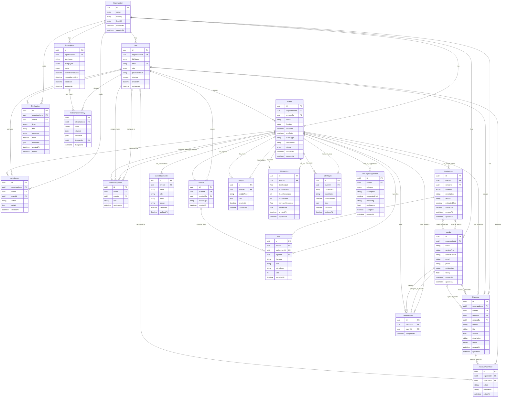

# ER Diagram - Event Finance Manager System

## High-Level Entity Relationship Diagram

This diagram shows the complete database structure for the Event Finance Manager system, organized by functional areas.

## Diagram Legend

### Relationship Types
- `||--o{` : One-to-Many (one Organization has many Users)
- `||--||` : One-to-One (one Event has one ROIMetrics)
- `}o--o|` : Many-to-One Optional (BudgetItem optionally links to Vendor)
- `}o--||` : Many-to-One Required (EventAssignment requires User)

### Key Abbreviations
- **PK**: Primary Key
- **FK**: Foreign Key
- **UK**: Unique Key
- **enum**: Enumeration (predefined values)

## Functional Areas

### 1. Multi-Tenancy Core
- **Organization**: Root entity - all data is scoped to an organization
- **User**: System users belonging to organizations
- **Subscription**: Billing and subscription management

### 2. Event Management
- **Event**: Core entity representing an event
- **EventAssignment**: Links users to events with roles
- **EventStakeholder**: External participants/stakeholders

### 3. Budget Planning
- **BudgetItem**: Budget line items directly on events
- **AiBudgetSuggestion**: AI-generated budget recommendations

### 4. Expense Management
- **Expense**: Actual expenses incurred
- **ApprovalWorkflow**: Multi-step approval process

### 5. Vendor Management
- **Vendor**: Vendor master data
- **VendorEvent**: Links vendors to events

### 6. Analytics & Integration
- **ROIMetrics**: Return on Investment calculations
- **Insight**: Analytics insights and recommendations
- **CRMSync**: CRM system integration tracking

### 7. Supporting Systems
- **Report**: Generated reports
- **File**: Flexible file storage
- **Notification**: User notifications
- **ActivityLog**: Audit trail

## Key Design Patterns

1. **Multi-Tenancy**: All major entities include `organizationId` for data isolation
2. **Flexible Relationships**: Files can link to Event, BudgetItem, or Report
3. **Optional Vendor Links**: Both BudgetItem and Expense support vendor as text or FK
4. **Audit Trail**: ActivityLog tracks all important actions
5. **One-to-One Analytics**: ROIMetrics and CRMSync are unique per event

## Notes for Client Presentation

- The system supports multiple organizations (multi-tenant architecture)
- Each organization has isolated data
- Events are the central entity around which all planning and tracking revolves
- Budget planning and expense tracking are separate but related processes
- The system includes AI-powered budget suggestions
- Complete audit trail via ActivityLog
- Flexible file storage for documents, receipts, and reports

