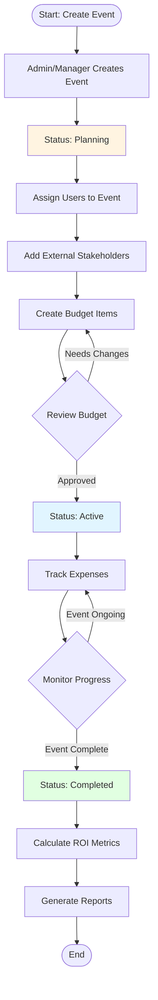
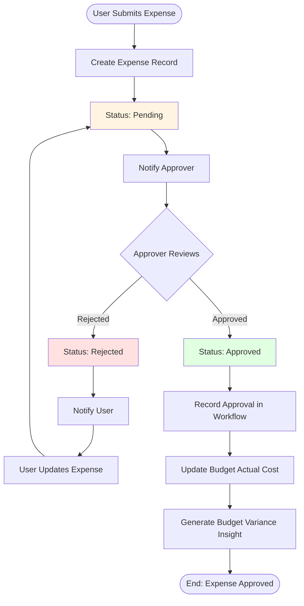
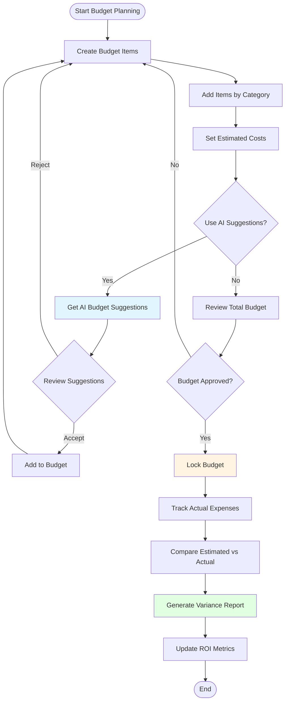
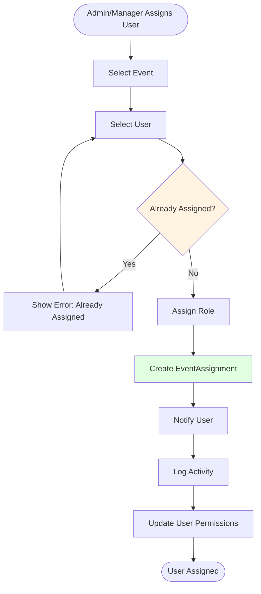
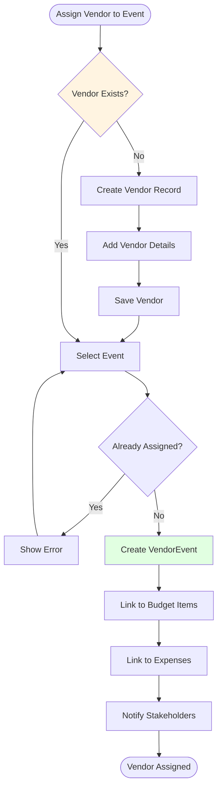
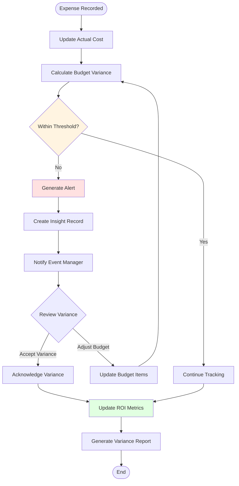
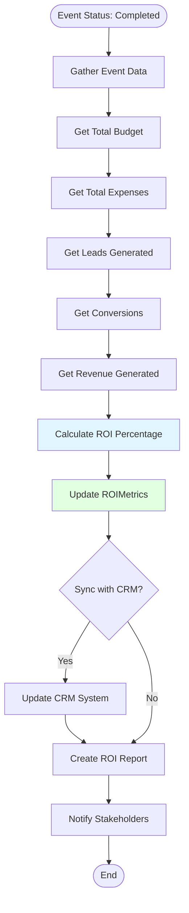
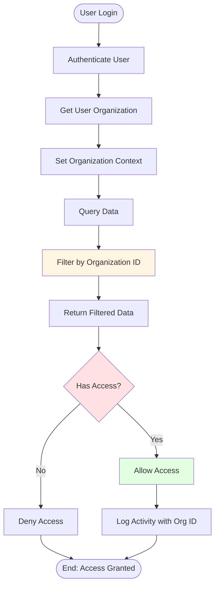

# Workflow Diagrams - Event Finance Manager System

This document contains visual workflow diagrams for key business processes in the Event Finance Manager system.

## 1. Event Lifecycle Workflow

Shows the complete lifecycle of an event from creation to completion.

## 2. Expense Approval Workflow

Shows the multi-step expense approval process.

## 3. Budget Planning Workflow

Shows how budgets are created, reviewed, and tracked.

## 4. User Assignment to Events Workflow

Shows how users are assigned to events and their roles.

## 5. Vendor Assignment Workflow

Shows how vendors are assigned to events.

## 6. Budget vs Actual Tracking Workflow

Shows how the system tracks budget variance and generates insights.

## 7. ROI Calculation Workflow

Shows how ROI metrics are calculated and updated.

## 8. Multi-Tenant Data Isolation Workflow

Shows how the system ensures data isolation between organizations.

## Workflow Summary

### Key Workflows Covered:

1. **Event Lifecycle**: Complete event management from planning to completion
2. **Expense Approval**: Multi-step approval process with notifications
3. **Budget Planning**: Creation, AI suggestions, and approval
4. **User Assignment**: Assigning users to events with roles
5. **Vendor Assignment**: Managing vendor relationships with events
6. **Budget Tracking**: Real-time variance tracking and alerts
7. **ROI Calculation**: Automated ROI metrics calculation
8. **Data Isolation**: Multi-tenant security and data isolation

### Common Patterns:

- **Status-based workflows**: Events and Expenses use status enums
- **Approval processes**: Multi-step approvals with notifications
- **Audit trails**: All actions logged in ActivityLog
- **Notifications**: Users notified at key workflow steps
- **Data validation**: Checks for duplicates and access control

